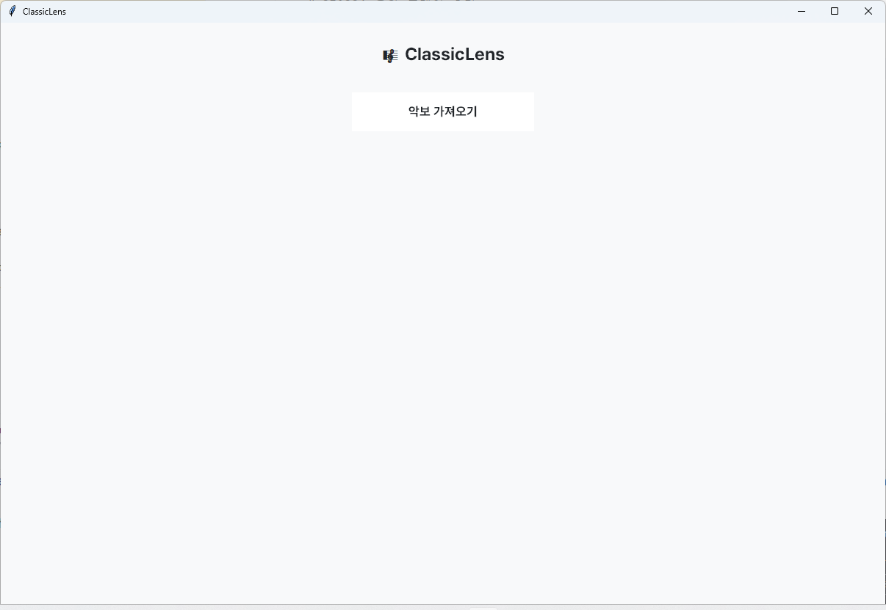
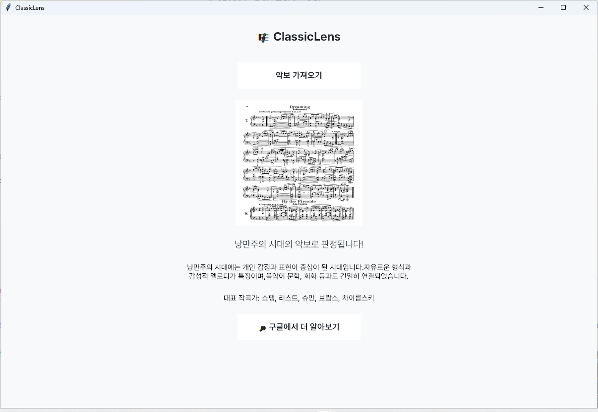

 

# 🎼 ClassicLens

악보 이미지를 기반으로 음악의 시대를 분류하는 AI 분석 도구입니다.  
SVM(Support Vector Machine) 모델을 이용하여 르네상스, 바로크, 고전, 낭만, 근대 다섯 시대를 예측하며,  
Tkinter GUI를 통해 결과와 함께 대표 작곡가 및 시대 설명을 제공합니다.
 
 
 
 

## 📘 프로젝트 개요

- 사용자가 악보 이미지를 업로드하면, 학습된 SVM 모델을 통해 **음악의 시대를 분류**합니다.  
- 결과는 GUI 창에서 **시대명(영문·한글)**, **대표 작곡가**, **간단한 설명**과 함께 표시됩니다.  
- **IMSLP 오픈데이터**를 기반으로 구축한 이미지 데이터셋을 학습에 사용했습니다.
 
 
 

## 🎯 프로젝트 목표

- 복잡한 음악 이론 없이 **이미지 인식만으로 시대 판별**  
- 음악 초보자도 **직관적으로 시대별 특징을 이해**할 수 있도록 GUI 구성  
 
 
 

## ⚙️ 파트별 상세 설명
 

### 🧠 Model

- **머신러닝 알고리즘:** `sklearn.svm.SVC`  
- **클래스:** `renaissance`, `baroque`, `classical`, `romantic`, `modern` (총 5개)  
- 학습이 끝난 모델을 `.pkl` 파일로 저장하여 GUI 실행 시 재학습 없이 바로 로드  
- 이미지를 **8×8로 축소 후 흑백 처리**, 픽셀값을 0~16 사이 값으로 변환해 벡터로 사용  
  

### 🖥️ GUI

- **프레임워크:** Python `tkinter`  
- 파일 탐색기로 악보 이미지를 선택할 수 있음  
- 선택한 악보 이미지와 예측된 시대명, 대표 작곡가를 한글로 표시  
- **Google 연계 검색 버튼**으로 시대 관련 정보를 바로 탐색 가능  
  

### 🧩 Data Processing

- 업로드된 이미지를 흑백 변환 후 8×8 크기로 리사이즈  
- 픽셀값을 0~16 범위로 정규화하여 **SVM 입력용 벡터로 변환**  
- 학습된 모델은 `joblib`으로 저장되어, GUI 실행 시 즉시 예측 가능  
   

## 📁 학습데이터 다운로드

악보 데이터 : https://naver.me/FK0MemlU 
배경 클래식 mp3 file : https://naver.me/5lfzW9fm
   

## 🔄 전체 플로우차트

1. 사용자가 악보 이미지를 업로드  
2. 프로그램이 이미지를 **그레이스케일 + 리사이즈** 처리  
3. 전처리된 이미지를 **numpy 배열로 변환**  
4. **SVM 모델 입력 → 예측된 음악 시대 반환**  
5. GUI 창에서 예측 결과, 시대 설명, 대표 작곡가를 표시  
6. **Google 검색 버튼**을 통해 추가 정보 탐색 가능  
   

## 🎨 UI 이미지

| 초기 실행 화면 | 예측 결과 화면 |
|----------------|----------------|
| |  |

    
## 🧩 사용 기술 스택

| 분야 | 기술 |
|------|------|
| Language | Python 3.10 |
| ML Library | scikit-learn, joblib, numpy |
| GUI | Tkinter, PIL (Pillow) |
| Data | IMSLP 악보 이미지 |
| Visualization | matplotlib |

   

## 🧠 학습 모델 정보

- 학습 데이터: IMSLP 오픈데이터 기반 악보 이미지  
- 모델: `SVC(kernel='rbf', gamma='scale', C=1.0)`  
- 결과 저장: `svm_image_era.pkl`  
   

## 👩‍💻 개발자

**고서연 (Seoyeon Ko)**  
- E-mail: [woogwayeon@gmail.com](mailto:woogwayeon@gmail.com)  
- GitHub: [https://github.com/woogwayeon](https://github.com/woogwayeon)  
   

📍 본 프로젝트는 Python 기반의 AI 음악 분석 도구로,  
이미지 인식과 머신러닝의 융합을 통해 악보로부터 시대를 예측하는  
실험적이고 창의적인 접근을 목표로 합니다.
      
